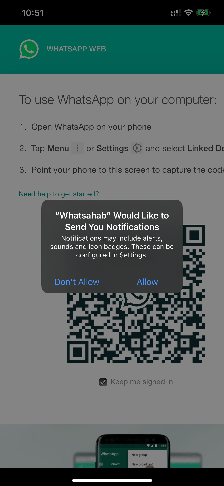
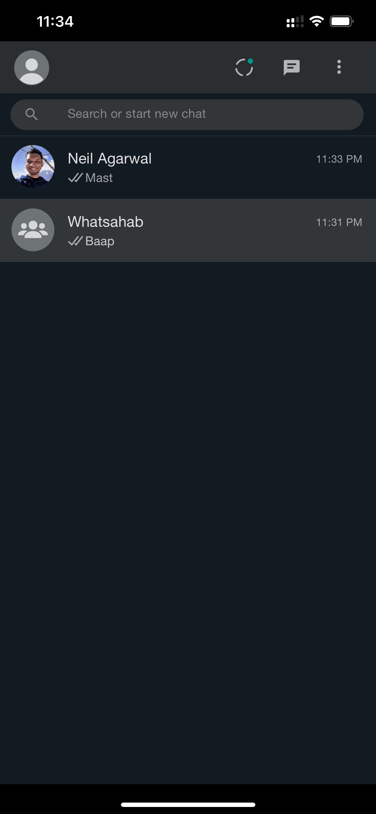
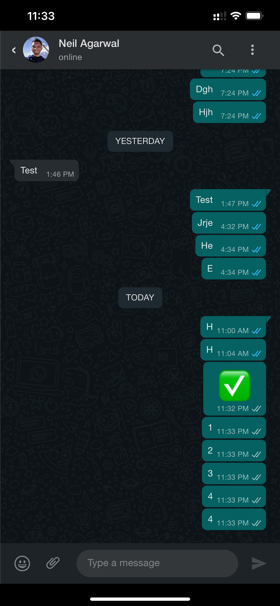

# Whatsahab

> The name is an internal joke at [@SudodevsHQ](https://github.com/SudodevsHQ), feel free to cringe.

Just a simple webview that wraps web.whatsapp.com (which isn't responsive) and applies mobile styling with some handy gestures.

Very useful for folks shifting to iOS from Android who don't want to lose their chats.

---

<p align="center">
  <a href="https://github.com/regalstreak/whatsahab/releases/">Download</a> •
  <a href="#screenshots">Screenshots</a> •
  <a href="#features">Features</a> •
  <a href="#building">Building</a> •
  <a href="#credits">Credits</a> •
  <a href="#contributing">Contributing</a> •
  <a href="#license">License</a>
</p>

## Screenshots

&nbsp;&nbsp;&nbsp;
&nbsp;&nbsp;&nbsp;
<br><br>
&nbsp;&nbsp;&nbsp;
&nbsp;&nbsp;&nbsp;

## Features

-   Mobile styles
-   Swipe right to go back from a chat
-   Local notifications (alpha)
-   File downloading
-   File uploading
-   Dark theme

## Todo

- [ ] Figure out a way to fix the infamous mouseover double click iOS webview issue
- [ ] Figure out a way to persist the webview after locking to recieve notifications
- [ ] Styling the remaining menus
- [ ] Debug sending voice notes
- [ ] Swipe down to reload etc

## Building

To clone and run this app, you'll need [Git](https://git-scm.com) and [Node.js](https://nodejs.org/en/download/) installed on your computer,

### `yarn start`

Starts the react-native bundler.

### `yarn android`

Builds and runs the app for Android.

### `yarn ios`

Don't forget to run `npx pod-install`
Builds and runs the app for iOS.

### `yarn test`

Launches the test runner in the interactive watch mode.

## Credits

This app uses the following amazing open source packages:

-   [React Native](https://reactnative.dev/)
-   [react-native-gesture-handler](https://github.com/software-mansion/react-native-gesture-handler)
-   [react-native-push-notification](https://github.com/zo0r/react-native-push-notification#readme)
-   [rn-fetch-blob](https://github.com/joltup/rn-fetch-blob)

## Contributing

-   Clone
-   Create a `<type>-` prefixed branch where `<type>` is a type from the below list
-   Make a pull request

We follow the conventional commit message spec. It's recommended that you read more about it below or on [conventionalcommits.org](https://www.conventionalcommits.org/).

Basically, the commit messages should be of the following form:

```
<type>[optional scope]: <description>

[optional body]

[optional footer(s)]
```

Types include and are limited to:
| Type | Version Bump | Description and used for |
| :----: | :---: |-----------------------|
| feat | minor | New features |
| fix | patch | Fixing bugs |
| revert | patch | Reverting commits |
| perf | patch | Performance improvements |
| refactor | patch | Refactoring code without changing functionality |
| build | patch | Build-system changes (deps, webpack, etc.) |
| chore | patch | General chores like version bump, merges, etc |
| ci | patch | CI/CD related changes |
| docs | none | Documentation |
| test | none | Adding/improving tests |
| style | none | Code-style, formatting, white-space, etc |

-   !: A commit that appends a `!` after the type/scope, introduces a breaking API change. A BREAKING CHANGE can be part of commits of any type and introduces a major version bump.
-   A scope of `norelease` with any commit message type will not bump a release version.

## License

MIT

---

> [Neil Agarwal](https://twitter.com/regalstreak) &nbsp;&middot;&nbsp;
> GitHub [@regalstreak](https://github.com/regalstreak) &nbsp;&middot;&nbsp;
> Twitter [@regalstreak](https://twitter.com/regalstreak) &nbsp;&middot;&nbsp;
> LinkedIn [@agarwal-neil](https://www.linkedin.com/in/agarwal-neil)
